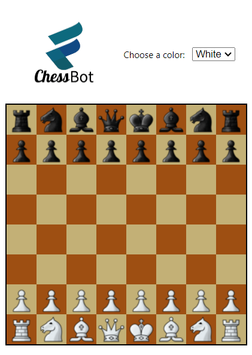

# ♟️ Chess Bot

<p align="center">
  
</p>

> Chess Bot is a free bot for chess.com that guides you towards the best moves in a given position.



---

## 📝 Description

Chess Bot integrates seamlessly with chess.com to provide real-time move suggestions. Improve your gameplay and surprise your opponents!

---

## 📚 How to use

### 📥 Installation

```bash
$> git clone https://github.com/MisTraleuh/ChessBot.git
```

1. Navigate to chrome extensions.
2. Enable developer mode.
3. Click on "Load unpacked" and select the ChessBot directory.
4. That's it! Your Chess Bot extension should now be running 😄

### 🏃‍♂️ Run

Start a game on chess.com. If you're uncertain about a move, simply click on the Chess Bot extension icon to reveal the best moves available.

## 📝 License

This project is under the MIT license. For more details, check out the [LICENSE](LICENSE) file.
